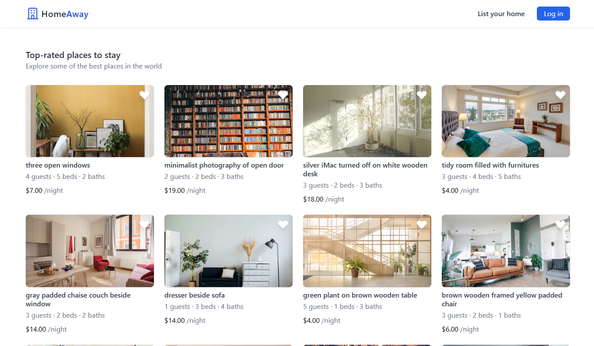
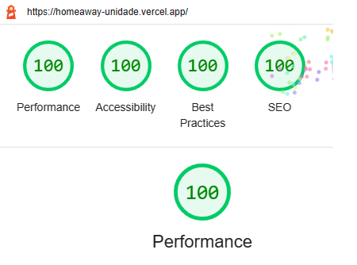

# HomeAway



## Description

HomeAway is a Airbn-like application that was created with a range of powerful technologies including NextJS, NextAuth, TailwindCSS, Prisma, and Supabase. It boasts a variety of features that make it easy for users to login or signup with their Google account or using magic links. You can save your favorite houses and even list your own property on the platform. Each house has its own dedicated page that is generated at build time using dynamic routing, thanks to NextJS' getStaticPaths and getStaticProps functions.

Prisma serves as a bridge between the application and our cloud-based PostgreSQL server, while Supabase helps us host images in a static bucket and provide the database for the application. Overall, the webapp is designed to provide a seamless and intuitive experience for users.

I have dedicated a significant amount of time to improving the SEO, boosting performance, and making the design responsive. As a result, I was able to achieve a score of 100 on Lighthouse for the website.



## Getting Started

You can deploy locally or visit the [Live Demo](https://homeaway-unidade.vercel.app/)

First, install the dependencies:

```bash
npm install
```

Now you can start the development server:

```bash
npm run dev
```

You can create a production build with:

```bash
npm run build
```

To start the production build execute:

```bash
npm start
```

## Key Features

- Skeleton UI while the page is loading
- User authorization and authentication is handled by NextAuth, which allows users to sign in with their Google account or via magic links sent to their email address.
- Dynamic routing is implemented for each base, with the ability to pre-render routes at build time or regenerate them at runtime for new listings.
- Logged-in users can list their house and add it to the Supabase database via the '/create' path. The site will then update with the new data.
- Users can favorite houses and view their favorites on the '/favorites' path. They can also view all of their own listed houses on the '/homes' path.
- All users can view the index page and the individual page for each house.
- To protect user data, pages are restricted so that users can only view their own favorites houses and listed houses.
- When creating a new listing, users can upload an image, which will be stored in a Supabase bucket and referenced in the PostgreSQL database.
- TypeScript and Prisma are used to ensure type safety during development, helping to prevent errors and improve the overall quality of the application.
